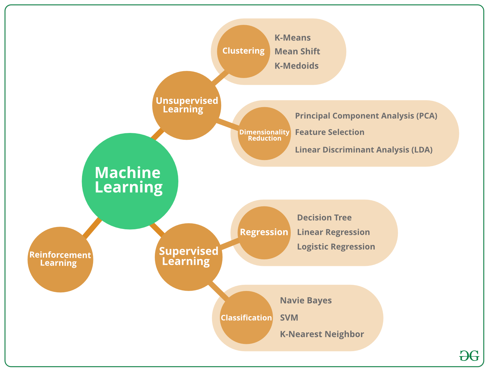

# ML-from-scratch

  

## Project problem and goal: 
This project comprises a series of machine learning algorithms developed from scratch in Python. The aim is to understand the underlying mechanics of machine learning techniques by implementing them without relying on high-level libraries like scikit-learn. Each algorithm is then applied to popular datasets, including the Iris dataset and the Breast Cancer Wisconsin (Diagnostic) dataset, to demonstrate its effectiveness and provide practical insights into its application.

## Dependencies
Python 3.x
NumPy
Pandas
Matplotlib
Scikit-learn (for data splitting and preprocessing)

## Algorithms Implemented

### Decision Trees
- Implementation of Classification and Regression Trees algorithms.
- Features: Gini impurity, information gain, and tree pruning.

### Random Forest
- Ensemble method combining multiple decision trees to improve prediction accuracy.
- Features: Bagging, feature randomness, and majority voting.

### k-means Clustering
- A clustering algorithm that partitions data into k distinct clusters based on distance metrics.
- Features: Centroid initialization, cluster assignment, and centroid update.

### Gradient Boosting
- Custom implementation of a Gradient Boosting algorithm, optimizing MSE by iteratively enhancing predictions with Decision Tree regressors.
- Features: Residual fitting, shrinkage rate control, and iterative model updates.

### AdaGrad
- An optimization algorithm that adapts the learning rate for each parameter.
- Features: Gradient accumulation, adaptive learning rates.

